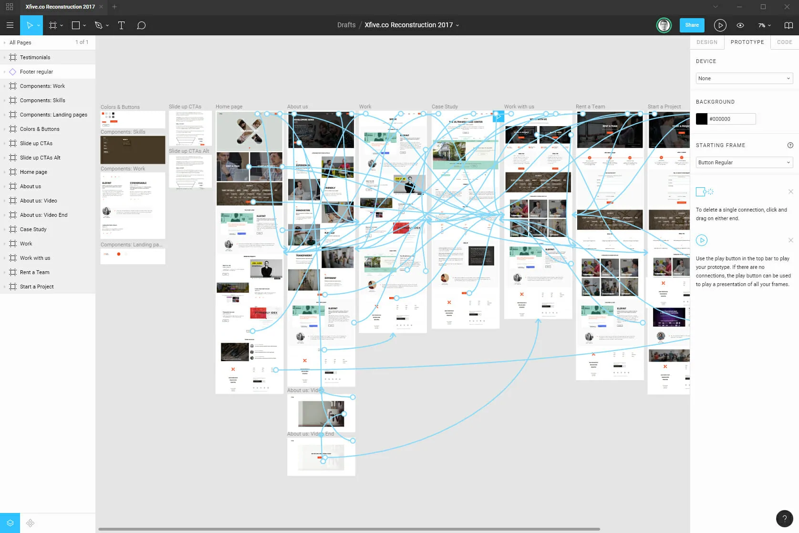

<!-- .slide: data-background-image="./img/architecture.jpg" data-background-opacity=0.2 -->

# Ausgewählte Aspekte des Software-Engineering 2 <!-- .element: class="r-fit-text"  -->

--

## Modulbeschreibung

In diesem Modul sollen aktuelle Themen des Software Engineerings aufgegriffen und den Studierenden vermittelt werden bzw. durch die Studierenden selbst erarbeitet werden. Es sollen Lehr- und Lerninhalte nach ihrer aktuellen Bedeutung (auch für die Partnerunternehmen) ausgewählt werden.
 

In der Lehreinheit 2 werden exemplarisch neue Ansätze der Modellierung, der Anforderungsanalyse, der Softwareentwicklung und des Projektmanagements sowie aktuelle und moderne Frameworks aufgegriffen

--

## Ablauf

 * Kickoff und Themenvergabe
   * Vorlesungskonzept: Lernen durch Lehren
 * 8 Vorlesungstermine
   * Gestaltung eines Veranstaltungstermins
   * 3-4 Studierende pro Gruppe
   * Präsentation, Demo, Übung
   * Abgabe der Materialien per Mail
* Klausur
   * Besteht aus Inhalten der Präsentationen
   * Dauer 75 Minuten

--

## Lernen durch Lehre

Ist eine handlungsorientierte und konstruktivistische Lernmethode, bei der sich Studierende einen bestimmten Vorlesungsinhalt selbstständig aneignen und im Anschluss ihren Kommilitonen vermitteln.

Die Studierenden prüfen außerdem mit Hilfe von selbstgewählten und geeigneten Übungen, ob die Studierende die Informationen wirklich verstanden haben.

Die Studierenden entwickeln, fördern und stärken vor allem kognitive Fähigkeiten und soziale Kompetenzen. Hierzu zählen Systemdenken und das Vermögen Wesentliches von Unwesentlichem zu unterscheiden sowie Teamfähigkeit und Kommunikationsfähigkeit.

Hierbei geht es jedoch nicht um eine umfassende Grundlagenforschung, sondern vielmehr um das Vermitteln von fachspezifischen und berufsangewandten Kenntnissen. Gerade in der vorherrschenden Informationsgesellschafft, gilt es permanent die Informationsströme zu kanalisieren, wichtiges Wissen zu filtern und auf konkrete Einsatzgebiete sinnvoll anzuwenden.

--

## Mögliche Themen

* Cloud Native Development
* UX und Prototyping (Figma)
* Internet of Things und Edge Computing
* Blockchain
* Test Driven Development
* Low Code / No Code
* Code Qualität
* GitHub

--

<!-- .slide: data-background-image="./img/cloud.jpg" -->
## Cloud Native Development

- Konzept
- Sprachen
- Tools
- Vor- und Nachteile

  

  
Cloud-native Computing ist ein Ansatz in der Softwareentwicklung, der Cloud Computing nutzt, um skalierbare Anwendungen in Cloud Infrastrukturen, Plattformen und Umgebungen zu erstellen und auszuführen. Gemäß der Cloud Native Computing Foundation (CNCF) prägen diesen Remote-Computing-Ansatz insbesondere Technologien wie Container, Microservices sowie serverlose Funktionen und unveränderliche Infrastrukturen (Immutable Infrastructures und Infrastructure as Code), die zumeist über deklarativen Code bereitgestellt werden.

--

<!-- .slide: data-background-image="./img/ui2.jpg" -->

## UX und Prototypting

- Definition von UX und seine Rolle im Entwicklungsprozess
- Prototyping zur Verbesserung der UX
- Vorstellung Figma

  

 :
  

  
  
--

<!-- .slide: data-background-image="./img/iot.jpg" -->

## Internet of Things und Edge Computing

Das Internet of Things (IoT) erzeugt große Datenmengen, die verarbeitet und analysiert werden müssen, um sie nutzbar zu machen. Edge Computing rückt die  Rechenkapazitäten näher an den Endbenutzer oder die Datenquelle heran, z. B. ein IoT-Gerät. 
Auf diese Weise können die IoT-Daten direkt am Netzwerkrand, dem sogenannten „Edge“, an dem sich das Gerät befindet, erfasst und verarbeitet werden, ohne dass die Daten erst an ein Rechenzentrum oder eine Cloud gesendet werden. So können Maßnahmen wie die Erkennung von Anomalien für die prädiktive Wartung schneller eingeleitet werden.  
Die Fähigkeit von IoT-Geräten, Rechenleistung zur Analyse von Echtzeitdaten zu nutzen, wird immer wertvoller. 

--

<!-- .slide: data-background-image="./img/chain.jpg"  -->

## Blockchain

- Technologie der Blockchain
- Bitcoinm, Etherum und der Rest
- PoW vs. PoS
- Smart Contracts
- (sinnvolle) Anwendungsfälle

--

<!-- .slide: data-background-image="./img/test1.jpg" -->

## Test Driven Development

- Erst die Tests, dann der eigentliche Code...
- Beschreibung des Ansatzes, mit Vor- und Nachteilen.
- Konzept des "Shift Left Testings"

--

<!-- .slide: data-background-image="./img/robot.jpg" -->

## Low Code / No Code

Low Code und No Code sind Entwicklungs-Ansätze in der IT, die mit wenigen beziehungsweise vollständig ohne Programmierkenntnisse auskommen.

Während Low Code mit einem geringen Programmieraufwand auskommt, verzichten No Code Plattformen gänzlich auf Programmierarbeit des Anwenders. Beide Technologien tragen dazu bei, dass zahlreiche Anwendungsgebiete in der Digitalisierung keiner manuellen Programmierung mehr bedürfen.

--

<!-- .slide: data-background-image="./img/sourcecode2.jpg" -->

## Code Qualität

 * Definition "Guter Code, schlechter Code"
 * Code Smells, Refactoring
 * Clean Code als Grundlage
 * Vorgehen statischer Codecheck (automatisch, Code Review)
 * Tools für Codecheck

--

<!-- .slide: data-background-image="./img/github.jpg" -->

## GitHub

github als Plattform zur Quellcodeverwaltung und darüber hinaus...

 - Repositories, Issues, Actions
 - github Pages
 - GitHub Codespace und Copilot
  - CI/CD und Automation

